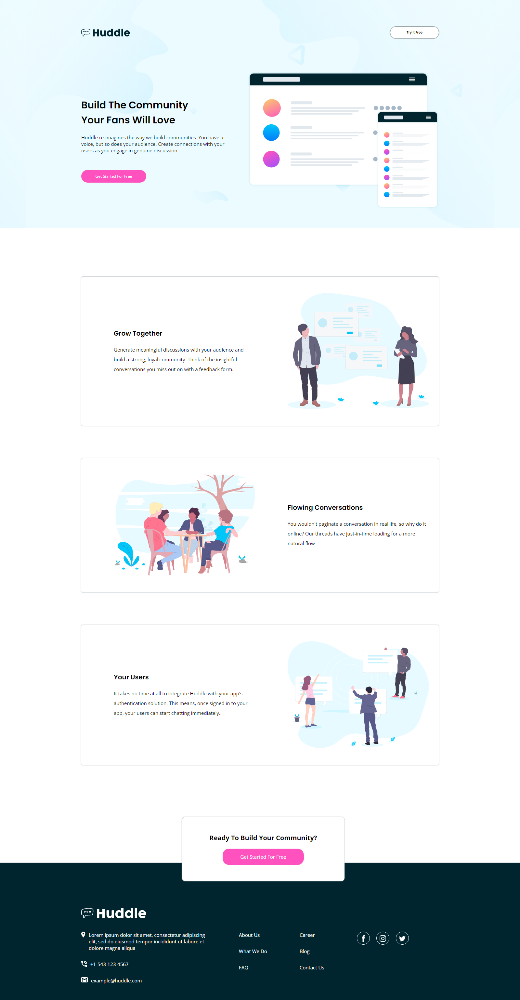

# Frontend Mentor - Huddle landing page with alternating feature blocks solution

This is a solution to the [Huddle landing page with alternating feature blocks challenge on Frontend Mentor](https://www.frontendmentor.io/challenges/huddle-landing-page-with-alternating-feature-blocks-5ca5f5981e82137ec91a5100). Frontend Mentor challenges help you improve your coding skills by building realistic projects.

## Table of contents

-  [Overview](#overview)
   -  [The challenge](#the-challenge)
   -  [Screenshot](#screenshot)
   -  [Links](#links)
-  [My process](#my-process)
   -  [Built with](#built-with)
-  [Author](#author)

## Overview

### The challenge

Users should be able to:

-  View the optimal layout for the site depending on their device's screen size
-  See hover states for all interactive elements on the page

### Screenshot

### Links

-  Solution URL: [GITHUB](https://github.com/theegr8dev/Huddle-landing-page)
-  Live Site URL: [VERCEL](https://huddle-landing-page-theta-jet.vercel.app)

## My process

### Built with

-  Semantic HTML5 markup
-  CSS custom properties
-  Flexbox

## Author

-  Website - [Alabi Khalid](https://github.com/theegr8dev)
-  Frontend Mentor - [@theegr8dev](https://www.frontendmentor.io/profile/theegr8dev)
-  Twitter - [@dean_of_lagoss](https://www.twitter.com/dean_of_lagoss)
